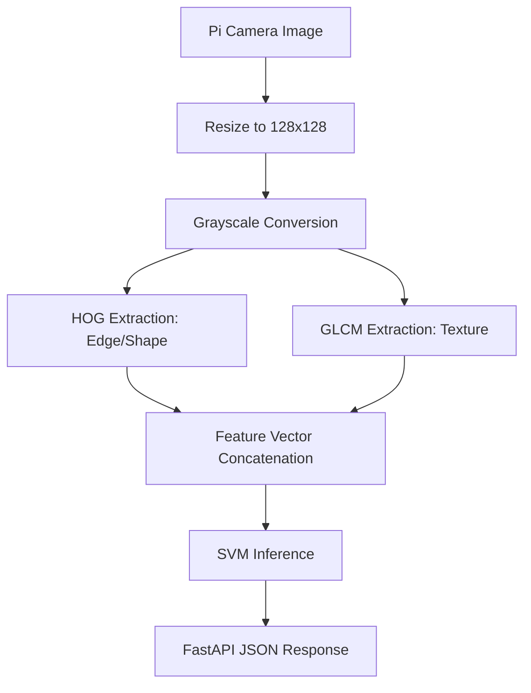

# Task: Initialize Pi-Optimized ML Backend

## Objective
Generate the FastAPI structure and the Python script for GLCM and HOG feature extraction, optimized for deployment on a Raspberry Pi.

## Context
- **Hardware**: Raspberry Pi (Resource constrained).
- **Goal**: Classify Dust, Bird Droppings, and Moss.
- **Methods**: SVM/Random Forest with manual feature extraction (HOG/GLCM).

## Visual Flow (Mermaid)

## Plan
- [x] Create directory structure for the new edge backend.
- [ ] Implement `features.py` using `skimage` for optimized HOG/GLCM extraction.
- [ ] Implement `main.py` with FastAPI `/detect` endpoint.
- [ ] Create `requirements-pi.txt` excluding heavy dependencies like PyTorch for the edge node.

## Execution Log
- [x] Task created.
- [ ] Implementing feature extraction logic.
- [ ] Implementing FastAPI boilerplate.
