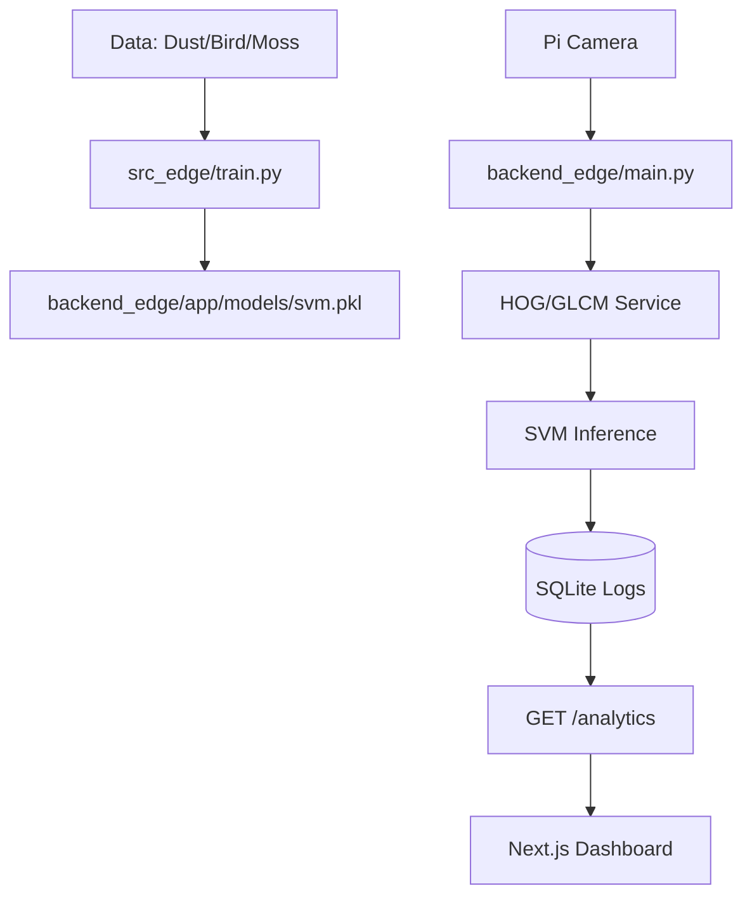

# Task: Edge-Optimized Multi-Class Integration Plan

## Objective
Align the new requirements (SVM/HOG/GLCM for Raspberry Pi) with the existing `solar-panel-image-proc` project to create a unified monorepo supporting both Deep Learning (Cloud) and Classical ML (Edge).

## Context
The current project uses ResNet18/PyTorch. The new requirement mandates a lightweight solution for Raspberry Pi using Scikit-Learn, HOG, and GLCM features to classify Dust, Bird Droppings, and Moss.

## Proposed Structural Alignment
```text
solar-panel-image-proc/
├── backend/               # Existing PyTorch Backend
├── backend_edge/          # NEW: FastAPI + Scikit-Learn (Edge Optimized)
│   ├── app/
│   │   ├── services/      # Feature extraction (HOG/GLCM)
│   │   ├── database/      # SQLite for local persistence
│   │   └── main.py        # /detect, /analytics, /capture
├── frontend/              # Existing Next.js Dashboard (To be enhanced)
├── src/                   # Existing PyTorch training scripts
├── src_edge/              # NEW: Scikit-Learn training & eval (SVM/RF)
└── data/                  # Shared data (Dust, Bird, Moss folders)
```

## Visual Flow (Mermaid)


## Detailed Plan

### Phase 1: ML Engine (Classical CV)
- [x] Create `src_edge/train.py`: Implementation of SVM and Random Forest training.
- [x] Create `src_edge/evaluate.py`: Compare Accuracy, Precision, Recall, F1 for SVM vs RF.
- [x] Implement `skimage` pipeline for HOG and GLCM extraction in `src_edge/features.py`.

### Phase 2: Backend (Edge Node)
- [x] **Data Handling**: Add SQLite integration using `SQLAlchemy` or `aiosqlite` to store detection results locally.
- [x] **Analytics**: Implement `GET /analytics` to return time-series data (frequency of dirt types).
- [x] **Hardware**: Implement `/capture` endpoint using `picamera` (or `opencv` fallback) to trigger the Pi Camera.

### Phase 3: Frontend (Unified Dashboard)
- [x] **Visualization**: Update `PredictionResult.tsx` to handle the new classes (Bird Droppings, Moss).
- [x] **Historical Charts**: Add `recharts` or `tremor` to visualize estimated efficiency loss based on dirt type.
- [x] **Remote Trigger**: Add a button to the dashboard that calls the Edge `/capture` endpoint.

## Outcome
Successfully aligned the existing monorepo with the Edge requirements. 
- Created `src_edge/` for HOG/GLCM/SVM training.
- Created `backend_edge/` for lightweight FastAPI deployment on Raspberry Pi with SQLite persistence.
- Enhanced `frontend/` with multi-class support, a historical analytics view, and a remote capture trigger.
- Unified the "Heavy" (Cloud/PyTorch) and "Lite" (Edge/SVM) paths into a single project structure.
