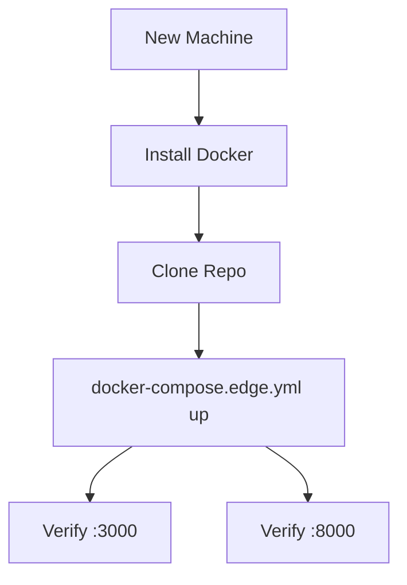

# Task: Multi-Machine Docker Verification

## Objective
Enable seamless verification of the hybrid architecture on different machines using Docker.

## Context
The user needs to test and run the system on different machines with the expectation that Docker handles the environment.

## Visual Flow (Mermaid)

## Plan
- [x] Create `backend_edge/Dockerfile`.
- [x] Create `frontend/Dockerfile`.
- [x] Create `docker-compose.edge.yml` for lightweight verification.
- [x] Document steps in `VERIFY.md`.

## Outcome
The project is now fully containerized. 
- The **Edge Stack** can be verified with a single command: `docker-compose -f docker-compose.edge.yml up --build`.
- The **Cloud Stack** remains available via `docker-compose.backend.yml`.
- A comprehensive `VERIFY.md` has been added to guide new machine setup.
