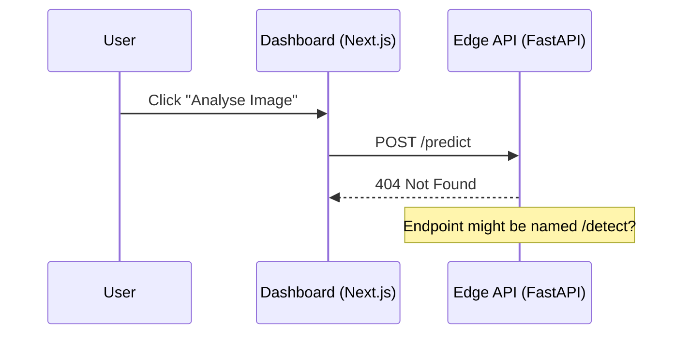

# Task: Troubleshooting 404 error on /predict endpoint

## Objective
Investigate and fix the 404 error occurring when the frontend attempts to call `http://localhost:8000/predict`.

## Context
- **Error**: 404 Not Found.
- **Frontend**: `ImageUpload.tsx` calls `http://localhost:8000/predict`.
- **Backend (Edge)**: Recently implemented FastAPI service.

## Visual Flow (Mermaid)

## Plan
- [x] Create bug report task.
- [ ] Verify endpoint name in `backend_edge/app/main.py`.
- [ ] Verify fetch URL in `frontend/src/components/ImageUpload.tsx`.
- [ ] Align naming conventions between frontend and edge backend.
- [ ] Test the fix with synthetic data.

## Execution Log
- [x] Task created.
