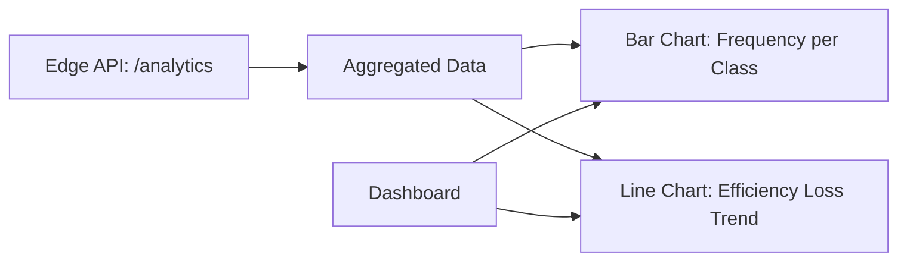

# Task: Frontend Visualization Enhancements (Charts & Icons)

## Objective
Enhance the dashboard with interactive charts (Bar/Line) to visualize detection frequency and efficiency loss trends, fulfilling Phase 3 of the roadmap.

## Context
- Current `/history` page only shows a list.
- Roadmap requires "Interactive charts (Line/Bar) to show detection frequency and estimated energy efficiency loss."

## Visual Flow (Mermaid)

## Detailed Plan

### Phase 1: Backend Aggregation
- [x] Update `backend_edge/app/main.py` to provide aggregated chart data (class distribution and efficiency trend).

### Phase 2: Frontend Infrastructure
- [x] Add `recharts` and `lucide-react` to `frontend/package.json` with React 19 compatibility.
- [x] Configure `Dockerfile` to handle peer dependency conflicts.

### Phase 3: Visualization Components
- [x] Implement `FrequencyChart` (BarChart) in `AnalyticsDashboard.tsx`.
- [x] Implement `EfficiencyTrendChart` (LineChart) in `AnalyticsDashboard.tsx`.
- [x] Add modern UI icons and hover states.

## Outcome
The dashboard now fulfills Phase 3 of the roadmap. Users can visualize:
- **Detection Distribution**: A bar chart showing the frequency of each dirt type.
- **Efficiency Trends**: A line chart showing the history of estimated efficiency loss.
- **Improved UI**: Modern iconography and a cleaner history table.
- **Robust Build**: Resolved React 19 dependency conflicts and TypeScript strict typing issues.
