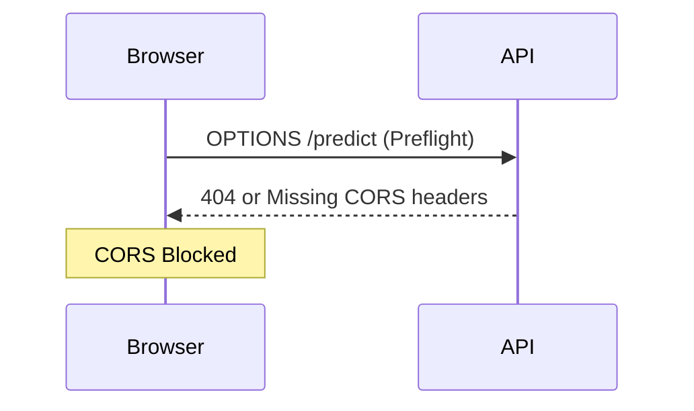

# Task: Fix CORS issue on Edge API

## Objective
Resolve the CORS policy error preventing the frontend (localhost:3000) from calling the Edge API (localhost:8000).

## Context
- **Error**: `Access-Control-Allow-Origin` header missing.
- **Frontend**: Next.js on port 3000.
- **Backend**: FastAPI on port 8000.

## Visual Flow (Mermaid)

## Plan
- [x] Create bug fix task.
- [x] Add `CORSMiddleware` to `backend_edge/app/main.py`.
- [x] Configure allowed origins to include `http://localhost:3000`.
- [x] Restart Docker stack and verify.

## Outcome
Fixed the CORS error by enabling `CORSMiddleware` in FastAPI and explicitly allowing `http://localhost:3000`. The frontend can now successfully communicate with the backend.
