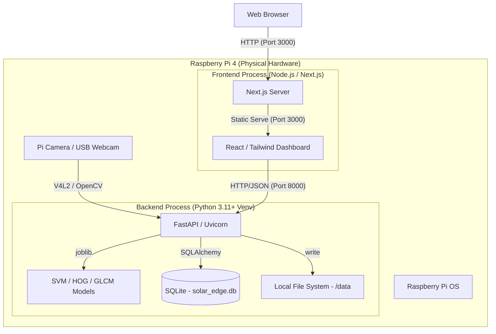

# Raspberry Pi 4 No-Docker Architecture Analysis

This document outlines the architecture for running `solar-panel-image-proc` directly on Raspberry Pi OS (Debian-based) without Docker.

## High-Level Architecture

The system consists of two main processes managed by `systemd`:
1.  **Edge Backend**: A FastAPI application serving ML predictions and handling camera capture.
2.  **Dashboard Frontend**: A Next.js application providing the user interface.



## Component Breakdown

### 1. Edge Backend (Python)
- **Path**: `/home/pi/solar-panel-image-proc/backend_edge`
- **Environment**: Virtual Environment (`.venv`)
- **Key Dependencies**: `fastapi`, `opencv-python-headless`, `scikit-learn`.
- **Configuration**: Managed via `.env` file.
- **Persistence**: 
    - SQLite database for logs and metrics.
    - Local directory `data/captured/` for images.

### 2. Dashboard Frontend (Next.js)
- **Path**: `/home/pi/solar-panel-image-proc/frontend`
- **Environment**: Node.js (v20+)
- **Build**: Production build (`next build`) served via `next start`.
- **Connection**: Communicates with Backend via `NEXT_PUBLIC_API_URL`.

## Process Management (systemd)

To ensure high availability and auto-start on boot, two systemd services should be created.

### `solar-backend.service`
```ini
[Unit]
Description=Solar Panel Edge API
After=network.target

[Service]
User=pi
WorkingDirectory=/home/pi/solar-panel-image-proc/backend_edge
ExecStart=/home/pi/solar-panel-image-proc/backend_edge/.venv/bin/uvicorn app.main:app --host 0.0.0.0 --port 8000
Restart=always
EnvironmentFile=/home/pi/solar-panel-image-proc/backend_edge/.env

[Install]
WantedBy=multi-user.target
```

### `solar-frontend.service`
```ini
[Unit]
Description=Solar Panel Dashboard
After=network.target solar-backend.service

[Service]
User=pi
WorkingDirectory=/home/pi/solar-panel-image-proc/frontend
ExecStart=/usr/bin/npm run start
Restart=always
Environment=NODE_ENV=production
EnvironmentFile=/home/pi/solar-panel-image-proc/frontend/.env

[Install]
WantedBy=multi-user.target
```

## Performance & Resource Optimization
- **Headless OpenCV**: Saves memory and avoids X11 dependencies.
- **SQLite**: Minimal overhead compared to PostgreSQL for edge deployment.
- **FastAPI**: Asynchronous handling allows efficient I/O for camera and DB operations.
- **Node.js**: Next.js 15 is optimized, but ensuring the Pi has at least 4GB RAM is recommended for the build step (or build on a more powerful machine and transfer).
